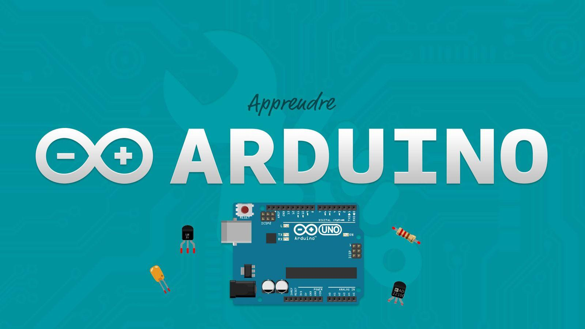

# *AutomativeGarden*

Нашият проект “Автоматична градина” представлява: поливателна система, която регулира температурата и се грижи за осветлението на разни плодове, зеленчуци и други растения. Параметрите, за които следи нашата “градина”, са: влажност на почвата, влажност на въздуха в помещението, температурата на околната среда. Целта на дадения проект е самостоятелно, без намесата на човек, да се грижи за растенията, поставени в “градината”, за период не по-малък от две седмици. Тя изцяло се грижи за поливането на растенията в нужно количество. Грижи се за набавяне на светлина, необходима за нормалното развитие на растението. Автоматичната градина следи постоянно за температурата в помещението и при нужда се регулира до необходимата температура.

## Как да си сваля и използвам проекта? (задължително)

### Инструкции за сваляне
*Тук опишете стъпка по стъпка как потребител, който си няма понятие от софтуер в github, да си свали и използва проекта*

1) Посетете [последната версия](https://github.com/uchihanaruto9371/AutomativeGarden/releases/tag/0.1) на проекта.
2) Под стрелката **Assets** изтеглете архива **Source code** (.zip или tar.gz)

### Инструкции за инсталация
*Тук опишете стъпка по стъпка как потребител, който си няма понятие от софтуер в github, да си инсталира проекта ви*

1) Разархивирайте файла
2) Посетете официалната ни [Документация](https://docs.google.com/document/d/1mjdg70pKtnkeyIzsIdol45YksGMIZSKrGm0fQBmtLOg/edit?usp=sharing)
3) Свържете отделните части по схемата от точка 3.

### Инструкции за стартиране на проекта
*Тук опишете стъпка по стъпка как потребител, който си няма понятие от софтуер в github, да стартира проекта ви*

1) Включете [ArduinoIDE](https://www.arduino.cc/en/Main/Software) 
2) Свържете Ардуиното с машината си, чрез USB порта.
3) Натиснете **Upload**.
4) Включете захранването на контролера.

## Използвани технологии (задължително)

*Ние ползваме официалното [ArduinoIDE](https://www.arduino.cc/en/Main/Software) за разработката на софтуера. и езика [C++](https://en.wikipedia.org/wiki/C%2B%2B).

## Информация за авторите на проекта (задължително)

* **Никита Проданов** -  - [uchihanaruto9371](https://github.com/uchihanaruto9371)
* **Велислав Боянов** -  - [0NZ1T4M](https://github.com/0NZ1T4M)

## Данни за разработката:

## Данни за репото:

